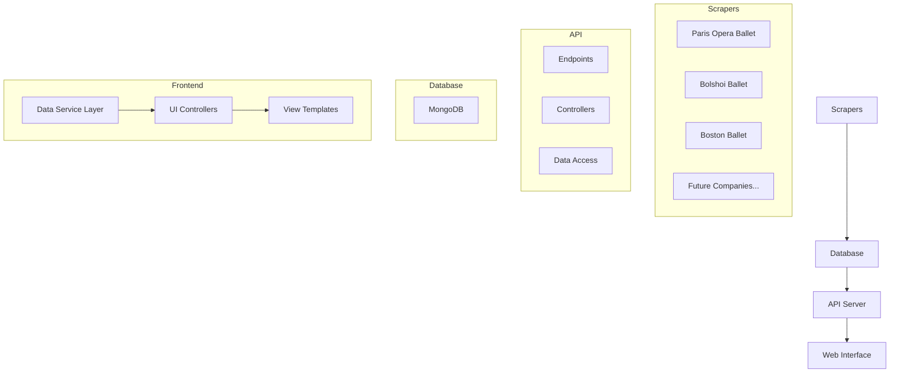
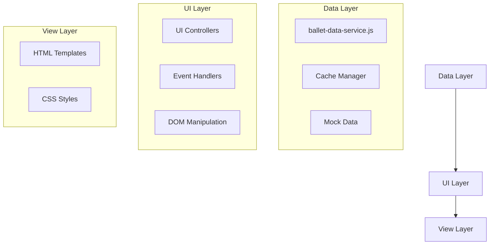

# System Patterns

## Architecture Overview

The Ballet World project follows a modular, service-oriented architecture with clear separation of concerns. The system is organized into the following main components:



## Component Relationships

### Scrapers

Each ballet company has its own dedicated scraper module that follows a consistent pattern:

1. **Configuration**: Company-specific settings and constants
2. **Main Scraper**: Extracts performance data from the company's website
3. **Detail Scraper**: Extracts detailed information for each performance
4. **Database Integration**: Stores the scraped data in MongoDB

The scrapers share common utilities for:
- Database operations
- Web requests and HTML parsing
- Selenium setup and interaction
- Data cleaning and formatting

### API Server

The API server provides a unified interface to access data from all ballet companies:

1. **Endpoints**: RESTful routes for accessing different resources
2. **Controllers**: Business logic for handling requests
3. **Data Access**: MongoDB queries and data formatting

### Web Interface

The web interface follows a clean separation of concerns with three distinct layers:



1. **Data Layer**: Handles API communication, caching, and data processing
   - `ballet-data-service.js`: Provides a unified interface for accessing data
   - Cache Manager: Handles client-side caching with localStorage
   - Mock Data: Provides fallback data when the API is unavailable

2. **UI Layer**: Manages business logic, event handling, and DOM manipulation
   - UI Controllers: Separate modules for each page type
   - Event Handlers: Manage user interactions
   - DOM Manipulation: Update the UI based on data changes

3. **View Layer**: Defines the structure and appearance of the UI
   - HTML Templates: Define the structure of each page
   - CSS Styles: Define the appearance of UI elements

## Design Patterns

### Factory Pattern

Used in the scrapers to create appropriate drivers (Selenium or Requests) based on configuration:

```python
def setup_selenium_driver():
    """Create and configure a Selenium WebDriver."""
    # Implementation...
    return driver

def fetch_with_requests(url):
    """Fetch HTML content using requests."""
    # Implementation...
    return html_content

def fetch_with_selenium(url):
    """Fetch HTML content using Selenium."""
    # Implementation...
    return html_content
```

### Strategy Pattern

Used for different scraping strategies (local file vs. web, Selenium vs. Requests):

```python
def scrape_all_performances(use_web=False, use_selenium=False, html_file=LOCAL_HTML_PATH, scrape_details=True):
    """
    Scrape all performances, either from a local file or from the web.
    """
    performances = []
    
    if use_web:
        performances = extract_ballet_performances_from_url(BASE_URL, use_selenium)
    else:
        performances = extract_ballet_performances_from_file(html_file)
    
    # Additional processing...
    return performances
```

### Repository Pattern

Used for database access, abstracting the underlying MongoDB operations:

```python
def get_collection(collection_name):
    """Get a MongoDB collection."""
    # Implementation...
    return collection

def store_performances(collection, performances):
    """Store performances in the database."""
    # Implementation...
    return success
```

### Command Pattern

Used in the main entry point script (`run.py`) to execute different commands:

```python
def main():
    """Main function."""
    parser = argparse.ArgumentParser(description='Ballet World Application')
    subparsers = parser.add_subparsers(dest='command', help='Command to run')
    
    # Command definitions...
    
    args = parser.parse_args()
    
    if args.command == 'pob':
        success = run_paris_opera_ballet_scraper(args)
    elif args.command == 'bolshoi':
        success = run_bolshoi_ballet_scraper(args)
    elif args.command == 'boston':
        success = run_boston_ballet_scraper(args)
    elif args.command == 'api':
        success = run_api_server(args)
    elif args.command == 'all':
        success = run_all(args)
    else:
        parser.print_help()
        return 1
    
    return 0 if success else 1
```

### Module Pattern (JavaScript)

Used in the frontend to create private and public members for each module:

```javascript
const BalletDataService = (() => {
    // Private variables and methods
    const API_BASE_URL = 'http://localhost:8000/api';
    const CACHE_VERSION = '1.0';
    
    const getCachedData = (key) => {
        // Implementation...
    };
    
    const setCachedData = (key, data) => {
        // Implementation...
    };
    
    // Public API
    return {
        getCompanyInfo: async (companyId, forceRefresh = false) => {
            // Implementation...
        },
        
        getAllCompanies: async (forceRefresh = false) => {
            // Implementation...
        },
        
        // Other public methods...
    };
})();
```

### Observer Pattern (JavaScript)

Used in the UI controllers to update the DOM when data changes:

```javascript
const CompanyPageController = (() => {
    // Private variables
    let companyData = null;
    let performances = [];
    
    // DOM update methods (observers)
    const renderCompanyInfo = (company) => {
        // Update DOM with company data
    };
    
    const renderPerformances = (performances) => {
        // Update DOM with performances data
    };
    
    // Data loading (subject)
    const loadCompanyData = async (forceRefresh = false) => {
        // Load data
        companyData = await BalletDataService.getCompanyInfo(companyId, forceRefresh);
        performances = await BalletDataService.getCompanyPerformances(companyId, forceRefresh);
        
        // Notify observers
        renderCompanyInfo(companyData);
        renderPerformances(performances);
    };
    
    // Public API
    return {
        init: () => {
            // Initialize the page
            loadCompanyData();
        }
    };
})();
```

## Data Flow

The data flows through the system as follows:

1. **Scraping**: Ballet company websites are scraped for performance data
2. **Storage**: Data is stored in MongoDB collections (one per company)
3. **API Access**: The API server retrieves data from MongoDB and serves it via RESTful endpoints
4. **Frontend Data Service**: The data service fetches data from the API, with caching and fallback to mock data
5. **UI Controllers**: Controllers process the data and update the DOM
6. **View Rendering**: HTML templates and CSS styles define how the data is presented to users

## Error Handling

The system implements a robust error handling strategy:

1. **Logging**: Comprehensive logging at different levels (INFO, WARNING, ERROR)
2. **Exception Handling**: Try-except blocks to catch and handle exceptions
3. **Fallbacks**: Default values and fallback mechanisms when data is missing
4. **Validation**: Data validation before storage and during API responses
5. **Frontend Error Handling**: Try-catch blocks in async functions with user-friendly error messages
6. **Mock Data Fallback**: When the API is unavailable, the frontend falls back to mock data

## Testing Strategy

The testing strategy follows a pyramid approach:

1. **Unit Tests**: Test individual functions and classes
2. **Integration Tests**: Test interactions between components
3. **End-to-End Tests**: Test the entire system

Tests use mocking to avoid external dependencies and ensure consistent results.

## Caching Strategy

The system implements a multi-level caching strategy:

1. **Client-Side Caching**: The frontend data service caches API responses in localStorage
   - Cache keys include version numbers to handle data structure changes
   - Cache expiry is set to 30 days
   - Force refresh option is available to bypass cache

2. **Server-Side Caching** (planned): The API server will cache database queries
   - In-memory cache for frequently accessed data
   - Redis cache for distributed caching (future)
