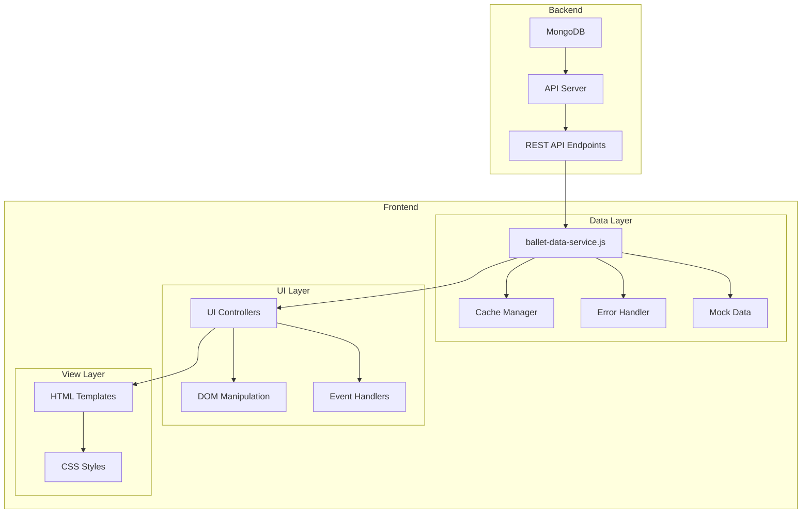

# Ballet World Frontend

This project is a frontend implementation for the Ballet World website, which displays information about ballet companies and their performances.

## Architecture

The project follows a clean separation of concerns with a dedicated data service layer that is independent of the UI:



## Project Structure

```
WorldBallet-Apr27Release/
├── css/
│   ├── styles.css             # Global styles
│   └── company-page.css       # Company page specific styles
├── images/
│   ├── logo.svg               # Site logo
│   └── placeholder-logo.svg   # Placeholder for company logos
├── js/
│   ├── ballet-data-service.js # Data service for API communication
│   ├── mock-data.js           # Mock data for fallback
│   └── ui-controllers/
│       ├── company-page.js    # Company page controller
│       └── ...                # Other page controllers
└── *.html                     # HTML templates
```

## Features

- Displays information about ballet companies and their performances
- Fetches data from the API with caching for better performance
- Falls back to mock data when the API is unavailable
- Responsive design for mobile and desktop

## Data Flow

1. The UI controller initializes when the page loads
2. The controller requests data from the data service
3. The data service checks the cache for data
4. If cached data exists and is not expired, it returns the cached data
5. If no cached data exists, it fetches data from the API
6. If the API is unavailable, it falls back to mock data
7. The controller renders the data to the UI

## Setup and Usage

1. Start the API server:
   ```
   cd /path/to/api
   python server.py
   ```

2. Open the HTML files in a browser:
   ```
   open company.html?id=paris_opera_ballet
   ```

## API Endpoints

The data service communicates with the following API endpoints:

- `/api/companies` - Get all companies
- `/api/companies/:id` - Get company information
- `/api/performances/:companyId` - Get performances for a company
- `/api/performances/:companyId/:performanceId` - Get performance details
- `/api/performances?current=true` - Get current performances
- `/api/search?q=:query` - Search performances

## Caching

The data service implements a caching strategy using localStorage:

- Cache keys are prefixed with `ballet_data_`
- Cache version is included in the key to handle data structure changes
- Cache expiry is set to 30 days
- Force refresh option is available to bypass cache

## Mock Data

Mock data is provided as a fallback when the API is unavailable. It includes:

- Company information for major ballet companies
- Performance data with titles, descriptions, dates, etc.
- Current and upcoming performances

## Browser Compatibility

- Chrome: Latest version
- Firefox: Latest version
- Safari: Latest version
- Edge: Latest version
